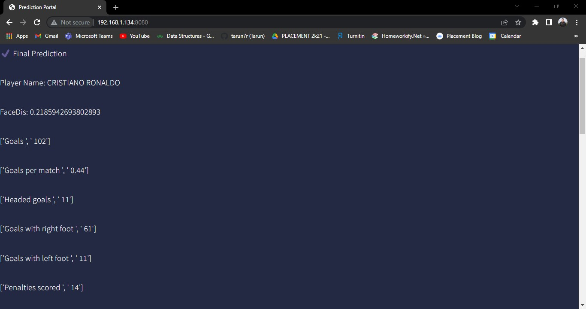

<h1>Premier League Player Recognition App</h1>
    
Welcome to the Premier League Player Recognition App. This application uses machine learning to recognize Premier League players in images and retrieve their stats. Follow the steps below to get started.

    <h2>Getting Started</h2>
    <ol>
      <li>Clone this repository to your local machine.</li>
      <li>Install the required libraries by running <code>pip install -r requirements.txt</code> in your terminal.</li>
      <li>Navigate to the project directory in your terminal.</li>
      <li>Run <code>python main.py</code> in your terminal.</li>
      <li>Open your browser and go to <a href="http://localhost:8080">http://localhost:8080</a> to access the web application.</li>
    </ol>
    <h2>How to Use</h2>
    <ol>
      <li>Click on the "Choose File" button and select an image of a Premier League player.</li>
      <li>Click the "Upload File" button to upload the image.</li>
      <li>The application will recognize the player in the image and retrieve their Premier League stats.</li>
      <li>The player's name and stats will be displayed on the results page.</li>
    </ol>

<H2>Home Page</H2>
<ul>
  <li>Upload the photo of the Premier League Player photo whose stats you want to know; The Machine learning model will predict the player name from the feature vectors  (uploaded image) and fetch the player stats</li> 
  Example: Stats of Cristiano Ronaldo | upload the Clear photo of Cristiano Ronaldo
     
</ul>

<H2>Prediction Page</H2>
<ul>
  <li>The model has successfully predicted the Player and Fetched the Premier League stats of the Player</li> 
  Example: It Successfully Predicted the Person present in the uploaded image and fetched the stats
     
</ul>
<H2>Project Progress</H2>
<ul>
  <li>successfully trained the model with 2022/23 season players photos with an accuracy of 92%</li>
</ul>

###### (Credits: Used the face_recognition python library to train the model and predict the player in the image)
